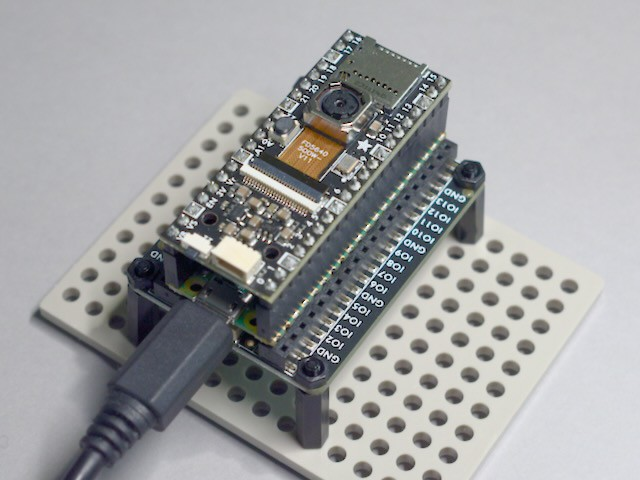

<!-- SPDX-License-Identifier: MIT -->
<!-- SPDX-FileCopyrightText: Copyright 2024 Sam Blenny -->
# CamTest

A frame-capture demo with Pi Pico, OV5640 camera, and CircuitPython.

In its current form, this:

1. Captures a 240x240 px grayscale frame every 2 seconds

2. Converts the 8-bit pixel data to 1-bit with a `>> 7`

3. Prints pixels to the serial console with Unicode Block Element characters

## Hardware

- Adafruit Proto Under Plate PiCowBell for Pico
  ([product page](https://www.adafruit.com/product/5905))

- Raspberry Pi Pico RP2040
  ([product page](https://www.adafruit.com/product/4864),
  [docs](https://www.raspberrypi.com/documentation/microcontrollers/raspberry-pi-pico.html))

- Stacking Headers for Raspberry Pi Pico - 2 x 20 Pin
  ([product page](https://www.adafruit.com/product/5582))

- Adafruit PiCowbell Camera Breakout, 72° lens
  ([learn guide](https://learn.adafruit.com/adafruit-picowbell-camera-breakout),
  [product page](https://www.adafruit.com/product/5945))

## Getting Started

To begin, solder the headers, assemble the stack of boards, install
CircuitPython, then copy the project bundle code to your CIRCUITPY drive. Once
that's all done, `code.py` will begin capturing camera frames and printing them
to the serial console. If you want to keep a frame, press the shutter button to
stop the camera. To restart the camera, type Ctrl-C then Ctrl-D in your serial
terminal emulator.

The output looks like this, if you make your terminal's font size *really*
small:

## Try the Project Bundle

This repo uses the GitHub Actions workflow from cookiecutter-playground-bundle
to build a project bundle zip archive for each tagged release. If you want to
try the code:

1. Go to the page for the
   [latest release](https://github.com/samblenny/camtest/releases).

2. Download the zip file attached to the release page. It should be named
   something similar to `camtest-27df0c3.zip`.

3. Expand the zip file (resulting folder should be named `camtest`).

4. Copy the contents of the `'camtest/CircuitPython 9.x'` folder to your
   CIRCUITPY drive (assuming your board is running CircuitPython 9.x).
